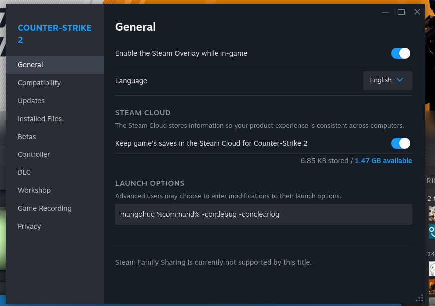

# CS2 Console HUD
An addon program to MangoHud. It utilizes Counter Strike 2 (CS2)'s logs output and displays it to 
MangoHUD.


# Supported Commands
- `cs2_hud generate-binds`
  -  Generate CS2 binds based on `config.json`. Must be a supported bind type. See [here](#bind-types).
- `cs2_hud read <bind-name>`
    - Reads the `console.log` and output a specific bind value that was set based on `bind-name`. The name format is `name` with space replaced as `_`. i.e `VOIP Volume` -> `VOIP_Volume`. Or you can directly use the bind name if it has no space.

# Bind types
## Interval Type
Generates a 'sliding' action from `min` to `max` (inclusive) with increments set with `step`.

Example: 
```json
{
    "name": "VOIP Volume",
    "type": "interval",
    "step": 0.1,
    "up_key": "F6",
    "down_key": "F5",
    "min": 0,
    "max": 2,
    "console": "snd_voipvolume",
    "default": 1.5
}
```

Will produce a bind for `snd_voipvolume` console command ranging from 0 to 2 and increments/decrements of `0.1` each time you press `F6`/`F5`. (Program will show as %)

## Execute Type
A simple bind that can execute multiple commands.

Example: 
```json
{
    "name": "Buy HE",
    "type": "execute",
    "key": "F10",
    "commands": ["c_he", "say buying he!"]
}
```

Will produce a bind `F10` and executes both
`c_he` and saying `buying he!` in the console.

## Cycle Type
A bind that will select & cycle through binds when all of the bind is set to the same key.

Example: You have VOIP Volume and Master Volume bind to F5 for down, and F6 for up key, you can
click on this bind to select whether to control VOIP Volume OR Master Volume.
```json
{
    "name": "Select Volume Control",
    "type": "cycle",
    "key": "F13",
    "bind_names": ["VOIP Volume", "Master Volume"],
    "default": 0
}
```

The `default` is the index position of the bind_names, starting from 0, this example it uses
`0` => `VOIP Volume`. You can put as many binds as you like.

# Setup
## Prerequisite
- Install [MangoHud](https://github.com/flightlessmango/MangoHud) on your machine.
- Install [Rust](https://www.rust-lang.org/tools/install) with rustup.

## Build from source
Make an executable compatible with your machine.
```ini
git clone https://github.com/InterStella0/cs2_console_hud
cd cs2_console_hud
cargo build --release
cd target/release
```

The executable are stored in `cs2_console_hud/target/release`.

## Configuring config.json
You have to modify `config.json` based on your needs. 

**Important:** `cs2_console_path` is required to be configured and set the full `console.log` file path. 

Refer to [Bind Types](#bind-types) for further explanation and example.


> `config.json` must be place right next to the executable file.

### Generate binds
Generate binds by running this command with your executable file you've created
```bash
./cs_hud generate-bind
```
It will produce a file called `bind_generated.cfg` which you have to place in your CS2 `cfg` folder and have `autoexec.cfg` to point to the file.
On Linux, you will find it at
```
~/.steam/steam/steamapps/common/Counter-Strike Global Offensive/game/csgo/cfg/
```

In `autoexec.cfg`:
```
exec bind_generated.cfg
```

## Modify MangoHud
You need to have a [MangoHud configuration](https://github.com/flightlessmango/MangoHud?tab=readme-ov-file#hud-configuration).

Within the `MangoHud.conf`, you can add the following `exec`.
```
# For VOIP Volume
custom_text=VOIP Volume
exec=cd /home/your-user/cs2_console_hud/ && ./cs2_hud read VOIP_Volume

# For Music Volume
custom_text=Music Volume 
exec=./cs2_hud read Music_Volume

# For Master Volume
custom_text=Master Volume 
exec=./cs2_hud read Master_Volume
```
assuming `/home/your-user/cs2_console_hud/` is your full path to the config.json + executable file.

## Modify Launch Options on CS2
You need to use MangoHUD with CS2 and enable
the `console.log` to be produced.

To do this, you can navigate to `Steam Library` >  `Counter Strike 2` > `Properties`.

Under the general tab, you will see `Launch Options`



### Command
```
mangohud %command% -condebug -conclearlog
```
- `-condebug` is to produce `console.log`
- `-conclearlog` is to clear console.log after game exits.

## Done
That's it, you only have to add these to fully setup everything. I assume if you can finish it you would know how to configure it even further.
